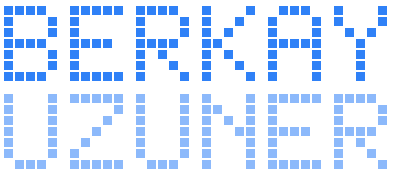

**Builder.** Istanbul.

I ship AI-native apps end to end at [Scate AI](https://scate.ai) — idea, build, launch, then watch what people actually do with it instead of what I assumed they would.

Before that, two companies. One became my university's official solution center. The other raised its first commitments and then taught me when to stop. Management engineering at ITU.

Most of what I make doesn't live here. It lives on a site with games, a guestbook, and a changelog nobody asked for:

**[berkayuzuner.com](https://berkayuzuner.com)** &nbsp;·&nbsp; [about](https://berkayuzuner.com/about) &nbsp;·&nbsp; [cv](https://berkayuzuner.com/cv) &nbsp;·&nbsp; [writing](https://berkayuzuner.com/blog) &nbsp;·&nbsp; [play](https://berkayuzuner.com/play) &nbsp;·&nbsp; [guestbook](https://berkayuzuner.com/guestbook)

The one thing I left open here is **[deep-focus](https://github.com/printNickname/deep-focus)** — a Pomodoro timer that blocks the sites I lie to myself about.

---

Still on the list: write a book, buy a summer house in Como, play street football in Brazil, get to space (tourism counts).

*Try first, then ask what's inside.*
